[dxu.one](https://dxu.one) &nbsp;·&nbsp;
[github](https://github.com/rwov) &nbsp;·&nbsp;
[email](mailto:rohan@dxu.one)

> developer & founder based in LA 

i work across iOS, full-stack web, AI, and hardware
hire me for anything you might need [email](mailto:rohan@dxu.one)

<samp>swift &nbsp; swiftui &nbsp; typescript &nbsp; javascript &nbsp; react &nbsp; next.js &nbsp; node.js &nbsp; python &nbsp; postgresql &nbsp; prisma &nbsp; firebase &nbsp; docker &nbsp; roblox lua &nbsp; git</samp>

**[Insightfull](https://github.com/InsightfullApp)** &nbsp;·&nbsp; <samp>swiftui, typescript, ai</samp> 
AI-powered health platform that analyzes journals, habits, vitals, and wearable 
data to uncover personalized insights, patterns, and long-term trends.

**[Xbuild](https://github.com/XbuildApp)** &nbsp;·&nbsp; <samp>swiftui, typescript, ai</samp> 
A work in progress AI powered app that lets anyone build native apps regardless 
of coding knowledge

**[opsh](https://opsh.dxu.one)** &nbsp;·&nbsp; <samp>typescript, bash, ai</samp> 
A command line shell that lets you run commands with natural language, without 
having to memorize bash commands and learn crazy syntax.

